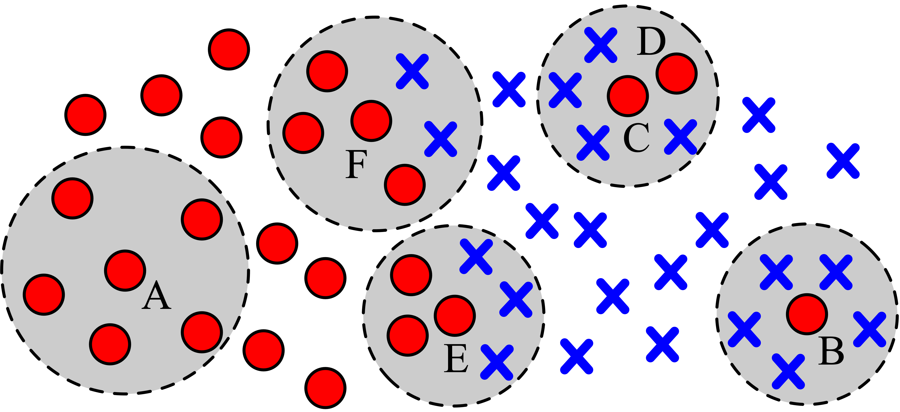

# Data Typology
This library computes the **data typology of real-world imbalanced datasets**, in order to measure the complexity of the associated classification problem:

- Minority class examples are categorized into 4 main types -- Safe, Borderline, Rare, and Outlier examples. The data typology of each dataset is associated to the difficulty of classification; 
- To identify the type of each data point, the class labels of its k-nearest neighbours are evaluated;
- As per the original formulation, a neighbourhood of `k = 5` and the `HVDM` distance (Heterogeneous Value Difference Metric) is considered by default. Other distance functions can be explored (implemented in `distances` folder);
- The distances considered to compute the neighbourhoods support both numeric and categorical data, as well as missing values.

## Types of Examples
Depending on their local neighbourhood (typically `k = 5`) examples can be categorized into 4 categories, as follows:

- `Safe` examples have 0 or 1 neighbours of the opposite class;
- `Borderline` examples have 2 or 3 neighbours of the opposite class;
- `Rare` examples have 4 neighbours of the opposite class. Additionally, the only neighbour of the same class should be either an outlier example, or a rare example as well;
- `Outlier` examples have all 5 neighbours of the opposite class.

Bellow is a representation of different example types: `A` is a `safe` example, surrounded by neighbours of its class; `B` is an `outlier` example, isolated in an area of the opposite class; `C` and `D` are rare examples and finally, `E` and `F` are borderline examples, located near the decision border between classes:




## Example of use:
The `arff-to-mat` folder contains a set of files to read `.arff` files, whereas the `DATA` folder contains some `.arff` files for testing.

The arguments required by distance functions are overall the following:

- `X`: matrix of data (patterns x features);
- `T`: column vector of classes;
- `feature_types`: 1/0 row vector indicating whether a feature in column i is categorical (1) or continuous (0);
- `min_class`: class target of the minority class (1 in this project)

Consider the `thoracic.arff` dataset provided in `DATA` folder, containing continuous features (PRE4, PRE5, AGE), and categorical features (the remaining), both binary and nominal. Here's an example of out to compute the data typology:

```matlab
% Import necessary libraries
addpath('arff-to-mat');
addpath('categorize');
addpath('distances');
addpath('data');
addpath('utils');

% Load the dataset (must contain the .arff extension)
filename = 'thoracic.arff';
data = arff2double(filename);
X = data.X; 
T = data.Y;
min_class = 1; % In this project, 1 is the minority and positive class
feature_types = data.isNomBin; % bool array of nominal (1) or numeric (0) features
distance_metric = 'HVDM-original';

% Calculate data typology
[S,B,R,O,data_types,D] = categorizeDataset(X, T, feature_types, min_class, distance_metric);
```

The output comprised the following:

- `S, B, R, O`: Percentage of safe, borderline, rare, and outlier examples, respectively:

```matlab
>> [S, B, R, O]

ans =

    1.4300   42.8600   15.7100   40.0000
```

- `data_types`: A string declaring the type of each example in data ('S/B/R/O' or 'X' denoting other class(es) rather than the minority).

```matlab
data_types =

    'XXXXBXORXXXXXBXXXXXXXXXXBXXOXXRXXXXXXXXXBOXSXXXBXXXXXXXXXBXXRXXXXXXOXXXXXXXBXOXXXXXXXXXXXXXXBXXXRXXBXXXXXXXXXXXXXXXBXXXXXXXXXXXOOXXXOXXXXBXXXXXRXXXXXXXOOXXXXXXXXXXXXXXXXBXXXRXOXXXXXXXXXOXXXXXOXXXROXXXXXXXXXXXXBXBXBXXXXXXBXXXXXXOXBXXXXXXXXBBXXBXXXXXXXXOXXXXXXXXOXXXXXXXBXOXXXOXXXXXXXXXXXXXXXXXXXXXRBXXXXOXXRXXXXXXOXXXXXXXXOXXXXXXXXXXXXOXXXXXOXXXXXXXOXBXXXXXXRXXXXBXXXXRXXXXXXXXXXXXXXXXXXBXXXXXXXXXXXXXXXXXOXXXXXOXXXXXXXXBBOXXXXBXXXXXXXXXXXXXXXXXXXXXXBXXXXXXXXXXXXXBXXXXXX'
```

- `D`: returns the distances between every pair of patterns. Note that although `thoracic.arff` is originally complete (i.e., it does not contain missing data), the heterogeneous functions can also handle missing values internally.


## Citation Request:
If you plan to use this library, please consider referring to the following papers:

```
@article{Santos2022,
  title={On the joint-effect of class imbalance and overlap: a critical review},
  author={Santos, Miriam Seoane and Abreu, Pedro Henriques and Japkowicz, Nathalie and Fern{\'a}ndez, Alberto and Soares, Carlos and Wilk, Szymon and Santos, Joao},
  journal={Artificial Intelligence Review},
  pages={1--69},
  year={2022},
  publisher={Springer}
}
```

```
@article{Santos2023,
  title={A unifying view of class overlap and imbalance: Key concepts, multi-view panorama, and open avenues for research},
  author={Santos, Miriam Seoane and Abreu, Pedro Henriques and Japkowicz, Nathalie and Fern{\'a}ndez, Alberto and Santos, Jo{\~a}o},
  journal={Information Fusion},
  volume={89},
  pages={228--253},
  year={2023},
  publisher={Elsevier}
}
```

## References
1. [Napierala K, Stefanowski J (2016) Types of minority class examples and their influence on learning classifiers from imbalanced data. J Intell Inf Syst 46(3):563–597.](https://link.springer.com/article/10.1007/s10844-015-0368-1)
2. [Napierala K, Stefanowski J, Wilk S (2010) Learning from imbalanced data in presence of noisy and borderline examples. In: International conference on rough sets and current trends in computing. Springer, pp 158–167.](https://link.springer.com/chapter/10.1007/978-3-642-13529-3_18)
3. [Stefanowski J (2013) Overlapping, rare examples and class decomposition in learning classifiers from imbalanced data. In: Emerging paradigms in machine learning. Springer, pp 277–306.](https://link.springer.com/chapter/10.1007/978-3-642-28699-5_11)
4. [Wojciechowski S, Wilk S (2017) Difficulty factors and preprocessing in imbalanced data sets: an experimental study on artificial data. Found Comput Decis Sci 42(2):149–176.](https://sciendo.com/article/10.1515/fcds-2017-0007)
5. [Santos, M. S., Abreu, P. H., Japkowicz, N., Fernández, A., Soares, C., Wilk, S., & Santos, J. (2022). On the joint-effect of class imbalance and overlap: a critical review. Artificial Intelligence Review, 1-69.](https://link.springer.com/article/10.1007/s10462-022-10150-3)
6. [Santos, M. S., Abreu, P. H., Japkowicz, N., Fernández, A., & Santos, J. (2023). A unifying view of class overlap and imbalance: Key concepts, multi-view panorama, and open avenues for research. Information Fusion, 89, 228-253.](https://www.sciencedirect.com/science/article/pii/S1566253522001099)


